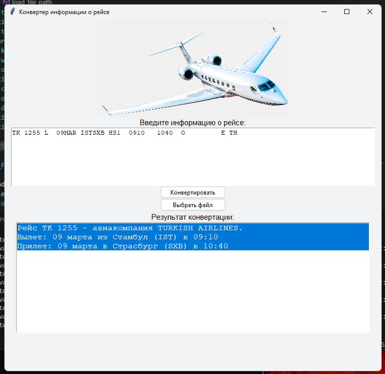

  
  

    
Гонопольский Александр

    
тел. +7 (905) 571-37-31

    
e-mail: g3ag@yandex.ru

    <a href="https://t.me/govardvolovets" style="text-decoration: none; ">Telegram</a> - <a href="https://t.me/govardvolovets" style="text-decoration: none;">https://t.me/govardvolovets</a>
     
    <a href="https://govardvolovets.github.io/resume/" style="text-decoration: none; ">Резюме</a>
    
Тестировщик ПО

  

 

## Игра на платформе Unity
* 2-D игра на платформе Unity. Цель - попасть шариком в стаканчик. Создал игру после прохождения курса "Профессия Unity разработчик". Делал для себя, что бы потренироваться.
  - Видео 1
  - Видео 2
  - Видео 3
  
 

## Программа для конвертации информации в удобный для человека вид
* Написал программу "Конвертер", для компании Laed.Aero. Суть программы простая, в поле вводится информация по авиаперелету в таком формате "", программа переводит эту информацию в удобочитаемый человеком вид "". По скольку программа бронирования авиабилетов в состоянии выдавать только в таком формате "", сотрудникам приходилось менять информацию вручную, моя программа ускоряет процесс и сводит к минимуму количество опечаток и ошибок. Программа написана на языке Python.
  - Видео
  - Фото

<a href="javascript:void(0);" onclick="showImage(5)">Видео</a>

  

<a href="javascript:void(0);" onclick="showImage(5)">Фото</a>

  

