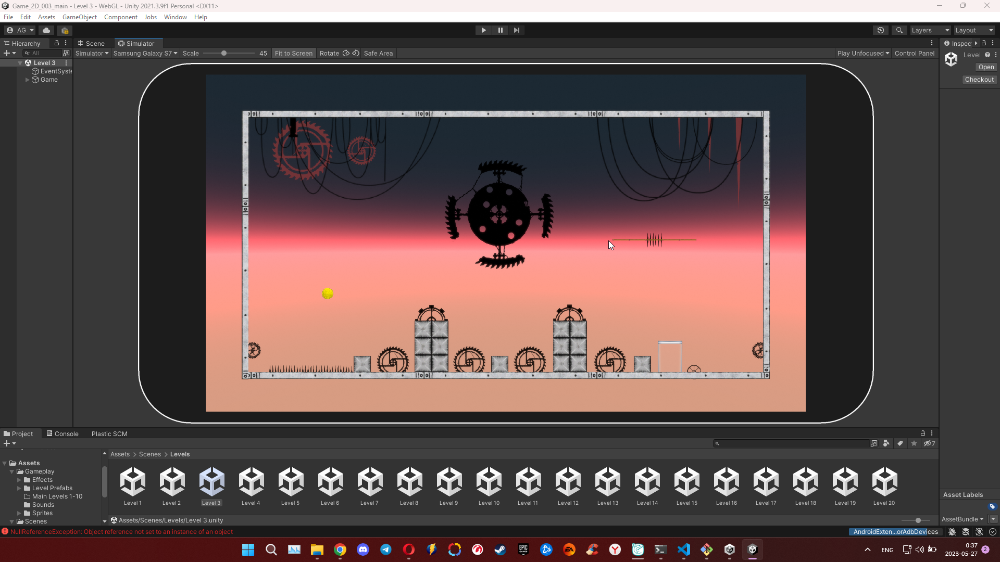
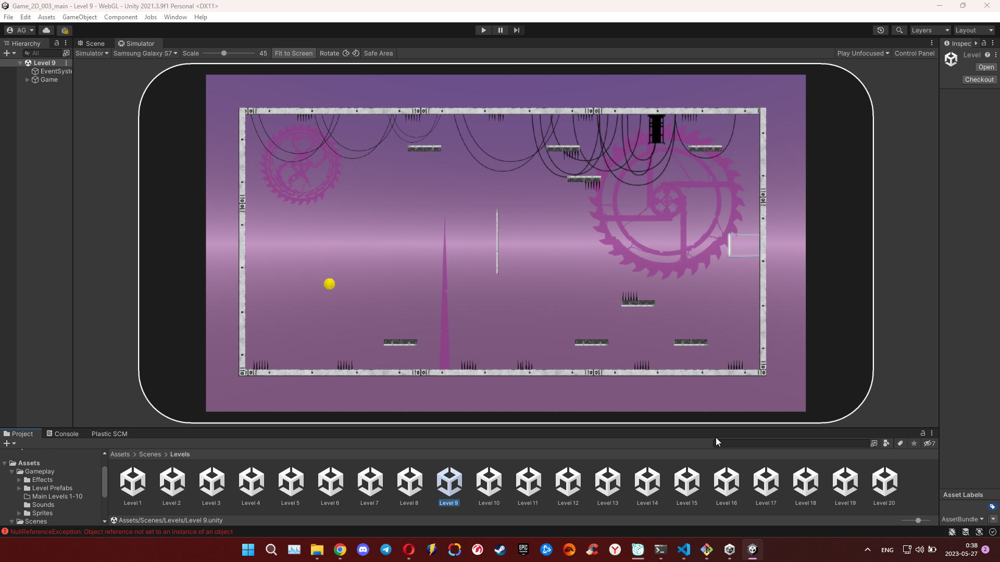
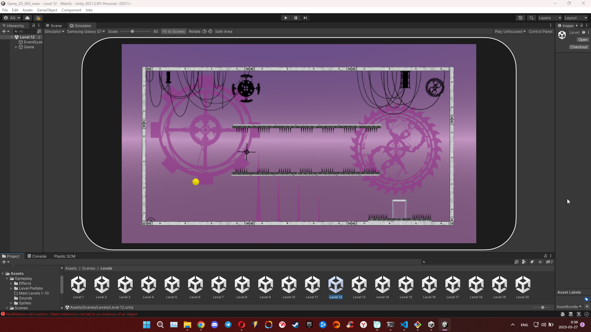
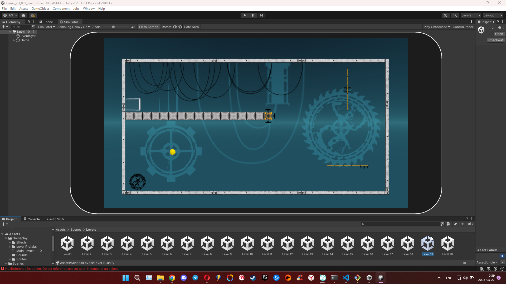

  
  

    
Гонопольский Александр

    
тел. +7 (905) 571-37-31

    
e-mail: g3ag@yandex.ru

    <a href="https://t.me/govardvolovets" style="text-decoration: none; ">Telegram</a> - <a href="https://t.me/govardvolovets" style="text-decoration: none;">https://t.me/govardvolovets</a>
     
    <a href="https://govardvolovets.github.io/resume/" style="text-decoration: none; ">Резюме</a>
    
Тестировщик ПО

  

 

## Игра на платформе Unity
* 2-D игра на платформе Unity. Цель - попасть шариком в стаканчик. Создал игру после прохождения курса "Профессия Unity разработчик". Делал для себя, что бы потренироваться.

  <a href="javascript:void(0);" onclick="showVideo(1)" class="video-link">Видео_1</a>
  <a href="javascript:void(0);" onclick="showVideo(2)" class="video-link">Видео_2</a>
  <a href="javascript:void(0);" onclick="showVideo(3)" class="video-link">Видео_3</a>

  <video id="videoObject1" src="videos/gameplayvideo1.mp4" width="100%" height="auto" controls></video>

  <video id="videoObject2" src="videos/gameplayvideo2.mp4" width="100%" height="auto" controls></video>

  <video id="videoObject3" src="videos/gameplayvideo3.mp4" width="100%" height="auto" controls></video>

  <a href="javascript:void(0);" onclick="showImage(6)" class="image-link">Фото_1</a>
  <a href="javascript:void(0);" onclick="showImage(7)" class="image-link">Фото_2</a>
  <a href="javascript:void(0);" onclick="showImage(8)" class="image-link">Фото_3</a>
  <a href="javascript:void(0);" onclick="showImage(9)" class="image-link">Фото_4</a>
  <a href="javascript:void(0);" onclick="showImage(10)" class="image-link">Фото_5</a>

  

  

  

  

  

 

## Программа для конвертации информации в удобный для человека вид
* Написал программу "Конвертер", для компании Laed.Aero. Суть программы простая, в поле вводится информация по авиаперелету в таком формате "TK 1255 L  09MAR ISTSXB HS1  0910   1040  O         E TH", программа переводит эту информацию в удобочитаемый человеком вид "Рейс TK 1255 - авиакомпания TURKISH AIRLINES.
Вылет: 09 марта из Стамбул (IST) в 09:10
Прилет: 09 марта в Страсбург (SXB) в 10:40". По скольку программа бронирования авиабилетов в состоянии выдавать только в своем формате, сотрудникам приходилось менять информацию вручную, моя программа ускоряет процесс и сводит к минимуму количество опечаток и ошибок. Программа написана на языке Python.

<a href="javascript:void(0);" onclick="showVideo(4)">Видео</a>

  <video id="videoObject4" src="videos/workConverter.mp4" width="100%" height="auto" controls></video>

<a href="javascript:void(0);" onclick="showImage(5)">Фото</a>

  

  ## Учебные работы
  - Page Oject. [Реализовал функцию тестирования переводов с карты на карту банковского приложения с использованием Page Object](https://github.com/GovardVolovets/page-object/blob/main/src/test/java/ru/netology/test/MoneyTransferTest.java). Нашел баг, завел [issues](https://github.com/GovardVolovets/page-object/issues/1)
  - Selenid/Selenium. Создал различные тесты для тестирования веб-приложения заказа карты клиентом с использованием Selenid/Selenium: [ссылка 1](https://github.com/GovardVolovets/cardApplication/blob/main/src/test/java/ru/netology/cardApplication/CardApplicationTest.java), [ссылка 2](https://github.com/GovardVolovets/selenide/blob/main/src/test/java/ru/netology/web/test/RegistrationTest.java), [ссылка 3](https://github.com/GovardVolovets/patterns-first-task/blob/main/src/test/java/ru/netology/delivery/test/DeliveryTest.java), [ссылка 4](https://github.com/GovardVolovets/patterns-second-task/blob/main/src/test/java/ru/netology/testmode/test/AuthTest.java)

